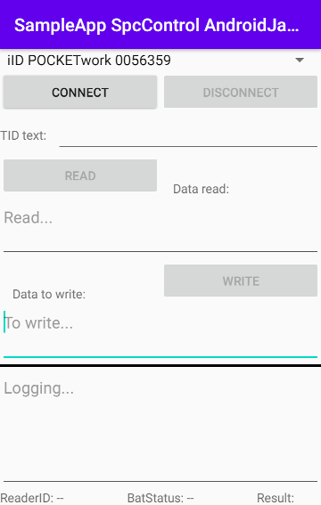

# samples-spc_android / Android SPC sample codes

This sample code is for **SPC** communication (devices in SPC mode) on Android devices.

//TODO Add link See "communication-modes/spc"

## Requirements
* Android Studio
* Android device to debug/deploy the sample code. You will need one of the following:
	* Any Android device with Bluetooth, to use one of our Bluetooth RFID reader
	* One of our supported industry Android devices, to use one of our RFID reader modules
* Micro-Sensys RFID reader (either Bluetooth or module) with appropriate script running
* RFID transponders

> For script check [Useful Links](#Useful-Links)

[Useful Links](#Useful Links)
//TODO link to Useful Links!

## Implementation
This code shows how to use **SpcInterfaceControl** class to communicate with a device running on SPC mode. 
Using this class the communication port can be open/closed. It automatically handles the data received and notifies the App using a Callback, and provides a function to send trigger commands to the script.

> Class description is available under API documentation. See Useful Links

//TODO link to Useful Links!

## Steps
Just import this project into Android Studio, connect the Android device to your computer and deploy the SampleApp.
If you have a iID®PENsolid or iID®POCKETwork paired over Bluetooth to the device, it will automatically list the devices in the Spinner. 

 1. Select the device you wish to connect to, and press CONNECT. Once the connect process finishes, the result will be shown in the EditText on the bottom side, and if the device is connected, the READ/WRITE buttons will be enabled.
 2. Received data will be automatically received on provided **SpcInterfaceCallback**
	"spcReaderHeartbeatReceived" will be called when Heartbeat is received
	"spcRawDataReceived" will be called when other data is received
 3. Use READ/WRITE buttons to trigger the processes built in the script

## Useful Links

 - [AAR Library und API documentation](https://www.microsensys.de/downloads/DevSamples/Libraries/Android/microsensysRFID%20-%20aar%20library/)
 - [Scripts](https://www.microsensys.de/downloads/DevSamples/Sample%20Codes/SPC/Additionals/Sample%20scripts/)
 - [iID® INTERFACE configuration tool (tool to upload script to reader)](https://www.microsensys.de/downloads/CDContent/Install/iID%c2%ae%20interface%20config%20tool.zip)

## Authors

* **Victor Garcia** - *Initial work* - [MICS-VGarcia](https://github.com/MICS-VGarcia/)